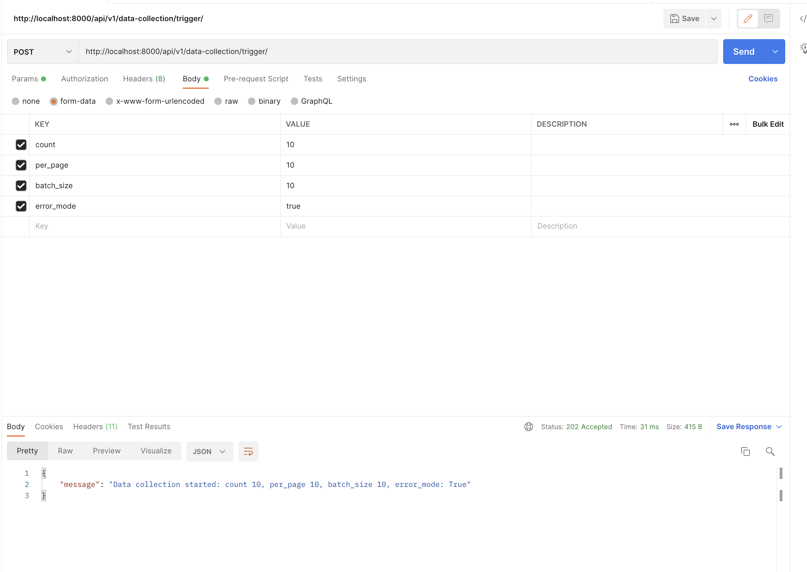
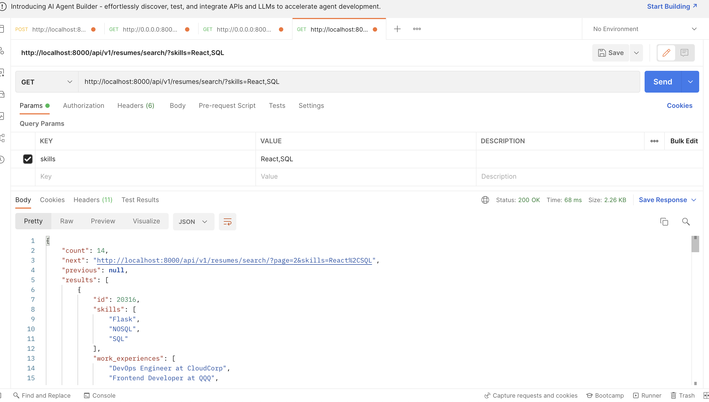
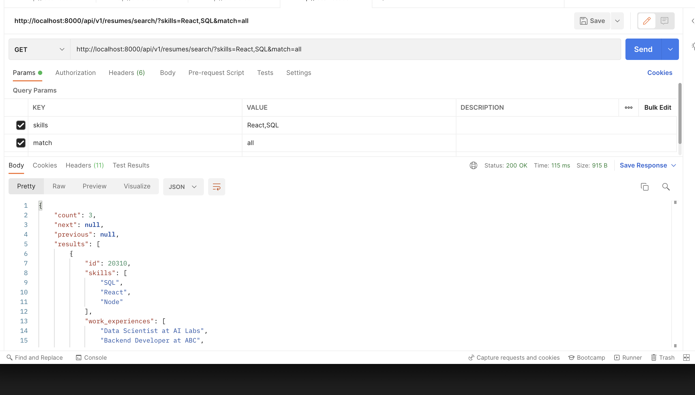

#


# Resume Service

This repository is a Django project implementing a coding assignment for **Hire Tufo**. The project was created to demonstrate a scalable architecture for resume data collection, processing, and searching.

## Setup

1. Build the project:
   ```sh
   docker-compose build
   ```
2. Copy and fill out the .env.example file
   ```sh
   cp .env.example .env
   ```
3. Start the service:
   ```sh
   docker-compose up
   ```
4. Enter the web service container:
   ```sh
   docker-compose exec web bash
   ```
5. Run migrations inside the web service container:
   ```sh
   python -m manage migrate
   ```

## Services Used

This project uses several technologies:

- Django → Web framework
- Celery → Task queue for handling background jobs
- Celery Beat → Scheduler for periodic tasks (not in use yet, but may be added for orphaned data recovery, for example)
- Flower → GUI for monitoring Celery tasks
- RabbitMQ → Message broker for Celery
- PostgreSQL → Database for storing resumes, and raw data

### Why Use Celery?

Django's ORM does not handle async processing well due to potential race conditions and transaction block limitations. Additionally, task persistence would be difficult if the web service went down.

While Celery introduces some infrastructure overhead and complexity, it does provides several advantages:

- Rate-limiting (e.g., 30 API calls/sec)
- Scalability (increase workers without blocking the main application)
- Automatic retries (e.g., API errors like `429 Too Many Requests`)
- Persistence (tasks don’t get lost if the web server crashes)
- Avoids database-related concurrency issues (From experience these are very difficult to debug!)
- Autoscale number of workers depending on the number of tasks

## How It Works

This project consists of three main layers:

1. Data Collection Layer  
2. Resume Layer  
3. API Layer  

### 1. Data Collection Layer

This layer separates data collection from resume processing to:

- Maintain separation of concerns.
- Prevent errors in the resume layer from disrupting data collection.
- Allow the service to collect data from multiple sources (e.g., other ATS systems, Github, Linkedin, etc).

**Why Asynchronous Data Collection?**

- The API rate limit is 30 calls/sec.
- Resume processing takes 2 seconds per resume.
- If the data collection and parsing were synchronous, the API would be idle while waiting for processing.
- Separating data collection allows API calls to complete faster.

Raw data is stored first, enabling debugging and reprocessing if needed. This prevents unnecessary re-fetching from the API when a parsing error occurs.

### 2. Resume Layer

This layer is responsible for:

- Parsing `RawData` objects into structured `Resume` objects.
- Validating extracted resumes.
- Storing parsed data in the database.

If an error occurs during parsing or validation, the system logs the error but does not block further resume processing.

### 3. API Layer

This layer provides endpoints for interacting with the service and mocking external API calls.

## How to Use

### Trigger Data Collection

To start collecting resumes, send a GET request:
```
POST http://localhost:8000/api/v1/data-collection/trigger
```

#### Body

| Key        | Type  | Default | Description |
|------------|------|---------|-------------|
| `count`      | int  | 100  | Number of resumes the internal endpoint should generate. |
| `per_page`   | int  | 10   | Number of resumes per page. |
| `batch_size` | int  | 10   | Size of the batch that the resume processor should parse at once. |
| `error_mode` | bool | false | If `true`, some resumes will have parsing errors for testing. |

#### Example API Request

```sh
curl -X POST "http://localhost:8000/api/v1/data-collection/trigger/" \
     -H "Content-Type: application/json" \
     -d '{"count": 200, "per_page": 20, "batch_size": 10}'
```


#### Response

```json
{
    "message": "Data collection started: count 100, per_page 10, batch_size 10, error_mode: False"
}
```


### Search Resumes

To search resumes that have already been collected, use:
```
GET http://localhost:8000/api/v1/resumes/search/
```

#### OR Search (default)

To search resumes containing any of the given skills:
```
GET http://localhost:8000/api/v1/resumes/search/?skills=React,SQL
```

```sh
    curl http://localhost:8000/api/v1/resumes/search/?skills=React,SQ
```


#### AND Search

To search resumes that contain all specified skills:
```
GET http://localhost:8000/api/v1/resumes/search/?skills=React,SQL&match=all
```

```sh
    curl http://localhost:8000/api/v1/resumes/search/?skills=React,SQL&match=all
```

## TODO (Future Improvements)

1. **Improve Data Collection Resiliency**  
   - Currently, pagination errors can break the job.
   - Solution: Implement checkpoints so a failed job can resume instead of restarting.

2. **Enhance Error Handling**  
   - If API rate limits persist too long, add exponential backoff or fallback strategies.

3. **Add Status Endpoint**  
   - Implement `/api/v1/data-collection/status/{data_request_id}/` to track job progress.
4. **Admin Panel**
   - Add Admin panel support for manual actions/tracking progress
